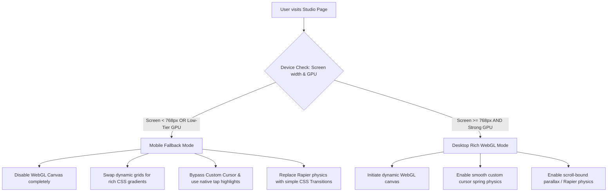

# Creative Studio Performance & Accessibility (A11y) Architecture Spec

This architecture specification outlines the strict, non-negotiable performance and accessibility bounds for our high-interaction creative studio website. Visual complexity must never come at the cost of speed or accessibility. All developers must implement and test their features against the budgets, guidelines, and patterns detailed below.

---

## 1. Performance Budget & Core Web Vitals (CWV)

Our interactive canvas elements, transitions, and scroll animations must run on a highly optimized critical rendering path. We enforce a zero-regression policy on the following targets, measured under simulated **Mobile 3G/Slow 4G (1.6 Mbps down, 150ms RTT) and Mid-Range CPU (4x slowdown)** profiles.

### 1.1 Core Web Vitals Key Performance Indicators (KPIs)

| Metric | Target (Desktop) | Target (Mobile) | Strategy for Studio Website |
| :--- | :--- | :--- | :--- |
| **LCP** (Largest Contentful Paint) | **< 1.0s** | **< 1.5s** | High-priority server-rendered typography, preloaded critical font weights, deferred canvas execution, zero render-blocking dynamic imports in the hero area. |
| **INP** (Interaction to Next Paint) | **< 50ms** | **< 100ms** | Keep main-thread tasks under 50ms. Yield the main thread during heavy calculations using `requestPostAnimationFrame` or `scheduler.yield()`. Debounce scroll/mouse position updates. |
| **CLS** (Cumulative Layout Shift) | **0.00** | **< 0.05** | Reserve aspect ratios for canvas elements. Load fallback fonts with identical local sizing overrides using Next.js `next/font` to eliminate font-swap shifts. |
| **TBT** (Total Blocking Time) | **< 100ms** | **< 200ms** | Split monolithic vendor chunks. Code-split and lazy-load WebGL loaders, geometry engines (e.g., Three.js, R3F), and custom animation physics. |

### 1.2 Bundle Size & Resource Limits

```
[Total Page Budget: 1.5MB Initial Load]
├── HTML/CSS (Critical Path Only) ── < 30kB
├── Core JS (Next.js framework) ── < 120kB (gzipped)
├── Custom Studio Chunks ────────── < 200kB (Framer Motion, Lenis, UI)
└── Deferred 3D Assets (WebGL) ──── Lazy Loaded via IntersectionObserver
```

- **JavaScript Budget Rules**:
  - **First Load JS**: Max **150kB** gzipped (includes React, Next.js framework, and basic layout components).
  - **Lazy Chunks**: Max **50kB** per interactive component (e.g., dynamic WebGL canvases, heavy shaders, charting engines).
  - **CSS**: Max **20kB** gzipped. All styles must compile to atomic Tailwind classes to maximize reuse and eliminate redundant stylesheet payloads.
- **Asset Size Boundaries**:
  - **Hero Images / Backgrounds**: Max **120kB** (Next-gen formats only: AVIF/WebP, properly sized via responsive `srcset`).
  - **Lottie / Vector Animations**: Max **40kB** (minify JSON, omit unused layer coordinates, or compile to high-performance vector CSS animations).
  - **Compressed 3D Meshes**: Max **350kB** (Draco compression required, single-mesh optimization, no redundant face arrays).
  - **3D Textures**: Max **512x512px** (Basis Universal / KTX2 GPU-ready textures only; never ship uncompressed raw PNG/JPEG textures to the GPU).

### 1.3 Performance Gating and Enforcement

1. **Lighthouse CI / GitHub Actions**: Every pull request is automatically tested against Lighthouse thresholds. Builds will fail if the simulated performance score falls below **90** or if accessibility drops below **100**.
2. **Real User Monitoring (RUM)**: Core Web Vitals are monitored in production via `next/vitals`. Telemetry data is reported back to our analytics endpoint to capture field performance on lower-end devices.

---

## 2. WebGL & Heavy Resource Management

Dynamic canvases and WebGL loops present a significant risk of main-thread execution blocks, battery drain, and thermal throttling. We implement a rigorous lifecycle policy for 3D components.

### 2.1 Lazy-Loading and Dynamic Canvas Initialization

Never load WebGL libraries (Three.js, React Three Fiber, Draco decoders) on initial page load. All heavy canvases must be wrapped in `next/dynamic` with `ssr: false` and deferred until the canvas enters the viewport.

#### Next.js Code Pattern: Deferred WebGL Canvas Loader
```tsx
import dynamic from 'next/dynamic';
import { useInView } from 'react-intersection-observer';

// Lazy load the heavy 3D scene, showing a fast HTML/CSS fallback in the meantime
const LazyThreeScene = dynamic(
  () => import('@/components/WebGLScene'),
  { 
    ssr: false, 
    loading: () => <WebGLFallback /> 
  }
);

export default function WebGLSection() {
  const { ref, inView } = useInView({
    triggerOnce: false,
    threshold: 0.05,
    rootMargin: '200px 0px', // Pre-initialize 200px before scrolling into view
  });

  return (
    <section ref={ref} className="relative w-full h-screen bg-[#050505] overflow-hidden">
      {inView ? <LazyThreeScene /> : <WebGLFallback />}
    </section>
  );
}

function WebGLFallback() {
  return (
    <div className="absolute inset-0 flex items-center justify-center bg-radial-gradient">
      {/* High-performance CSS background replacing the canvas before load */}
      <div className="absolute inset-0 bg-gradient-to-tr from-[#050505] via-[#0f0f0f] to-[#050505] opacity-80" />
      <span className="sr-only">Interactive canvas loading...</span>
    </div>
  );
}
```

### 2.2 Three.js / R3F Resource Lifecycle & Memory Leak Mitigation

Unmounting dynamic assets must result in complete memory recovery. Garbage collection in WebGL is not automatic; textures, geometries, and materials must be manually disposed of to prevent the tab from crashing during long user sessions.

#### WebGL Cleanup Rule
For every raw Three.js element or custom shader buffer created:
1. Traverse the scene graph on component destruction.
2. Call `.dispose()` on all geometries.
3. Call `.dispose()` on all materials. For materials with textures, loop through properties and call `.dispose()` on the texture instances.
4. Call `renderer.dispose()` and clear the canvas WebGL context buffer.

```typescript
useEffect(() => {
  return () => {
    if (!rendererRef.current) return;
    
    const scene = sceneRef.current;
    scene.traverse((object: any) => {
      if (!object.isMesh) return;
      
      // Dispose geometry
      if (object.geometry) {
        object.geometry.dispose();
      }
      
      // Dispose materials & textures
      if (object.material) {
        if (Array.isArray(object.material)) {
          object.material.forEach((mat) => disposeMaterial(mat));
        } else {
          disposeMaterial(object.material);
        }
      }
    });

    rendererRef.current.dispose();
    console.log("WebGL Scene fully garbage collected and disposed.");
  };
}, []);

function disposeMaterial(material: any) {
  material.dispose();
  for (const key of Object.keys(material)) {
    if (material[key] && typeof material[key].dispose === 'function') {
      material[key].dispose();
    }
  }
}
```

### 2.3 CPU-Friendly Render Loops & Frame Rate Throttling

Continuous 60fps rendering is unnecessary when scenes are static. We enforce three core practices to restrict useless CPU and GPU calculations:
1. **IntersectionObserver Pause**: Immediately cancel the render loop (`cancelAnimationFrame`) when the canvas scrolls out of view.
2. **On-Demand Rendering (Three.js / Canvas)**: Set `frameloop="demand"` in React Three Fiber scenes. The canvas will only render a new frame if inputs or uniforms change, rather than drawing continuously at 60Hz.
3. **Adaptive Frame Throttling**: Throttle the render loop under heavy loads. If a high CPU load is detected (frame times exceed 16.6ms), dynamically throttle the loop to **30fps** or reduce pixel ratio scaling factors (`renderer.setPixelRatio(Math.min(window.devicePixelRatio, 1.5))`).

---

## 3. Mobile & Device Fallback Architecture

Visually striking 3D experiences can quickly turn a mobile device hot, drain its battery, and lag its interface. We use a progressive enhancement pattern where mobile devices receive a lightweight, battery-saving visual equivalent.



### 3.1 Strict Feature Flag Rules for Fallbacks

All dynamic elements must check global responsive limits and user motion settings before initialization.

```typescript
export function checkDeviceCapabilities(): { isCapable: boolean; reason?: string } {
  if (typeof window === 'undefined') return { isCapable: false };
  
  // Rule 1: Mobile screens never run raw heavy WebGL physics
  if (window.innerWidth < 768) {
    return { isCapable: false, reason: 'viewport-below-threshold' };
  }

  // Rule 2: Respect hardware capacity checks if available
  const memory = (navigator as any).deviceMemory;
  const threads = navigator.hardwareConcurrency;
  if ((memory && memory < 4) || (threads && threads < 4)) {
    return { isCapable: false, reason: 'hardware-limitations' };
  }

  // Rule 3: Gracefully fail if GPU driver isn't supported or fails to init WebGL
  try {
    const canvas = document.createElement('canvas');
    const gl = canvas.getContext('webgl') || canvas.getContext('experimental-webgl');
    if (!gl) return { isCapable: false, reason: 'no-webgl-context' };
  } catch (e) {
    return { isCapable: false, reason: 'webgl-exception' };
  }

  return { isCapable: true };
}
```

### 3.2 Specific Fallback Mappings

- **Dynamic Interactive Canvas**:
  - **Desktop**: Full interactive WebGL particle network responding to coordinates with spring smoothing.
  - **Mobile**: Unmounted canvas. Background is a static SVG noise node overlaid with a rich radial CSS gradient.
- **Custom Cursor Lag Remediation**:
  - **Desktop**: Mouse-tracked custom floating DOM element using Framer Motion spring physics with `mix-blend-difference` blending.
  - **Mobile/Touch**: Completely unmounted component. Body uses standard system cursor. Hover and tap states utilize CSS touch highlights (`-webkit-tap-highlight-color: rgba(255, 255, 255, 0.1)`).
- **Parallax and Scroll Pins**:
  - **Desktop**: Custom scroll pinning using GSAP ScrollTrigger or Lenis, drifting elements relative to scroll speed.
  - **Mobile**: Linear, non-blocking native scroll. Parallax elements display in their static layout positions.

---

## 4. Semantics & Assistive Technology

Interactive studio sites often fail screen-reader tests due to non-semantic nested divs, missing tab focus hooks, and untranslated canvas layers. The structure of our application must remain fully visible to screen readers (NVDA, JAWS, VoiceOver) regardless of 3D overlays.

### 4.1 Strict Structural Markup Constraints

```html
<!-- Every main page layout must follow this structural layout exactly -->
<header role="banner" class="fixed top-0 z-50">
  <a href="#main-content" class="skip-link">Skip to main content</a>
  <nav aria-label="Primary Navigation">
    <!-- Nav Links -->
  </nav>
</header>

<main id="main-content" role="main" tabindex="-1" class="outline-none">
  <!-- Content Sections must use explicit semantic elements -->
  <section aria-labelledby="hero-title">
    <h1 id="hero-title">Signal Studio</h1>
  </section>
  
  <section aria-labelledby="portfolio-title" id="work">
    <h2 id="portfolio-title">Selected Work</h2>
    <!-- Dynamic slides -->
  </section>
</main>

<footer role="contentinfo">
  <!-- Footer elements -->
</footer>
```

### 4.2 ARIA Markup Rules for Interactive Studio Elements

1. **The Skip Link Requirement**:
   - The first focusable element in the DOM must be a "Skip to main content" link.
   - It remains invisible off-screen (`translate-y-[-100%]`) until focused via keyboard (`tab`), where it shifts visible at the top of the viewport.
2. **Ornamental Hiding (`aria-hidden`)**:
   - WebGL canvases, background noise meshes, ornamental icons, and custom cursor elements **must** carry `aria-hidden="true"` and `tabindex="-1"`.
   - Never allow a screen reader to discover focusable elements hidden within the threejs render context.
3. **Accessible Names for Dynamically Interactive Controls**:
   - Custom toggle controls (e.g., sound toggles, visual modes, navigation icons) must explicitly declare their roles and state changes using `aria-label`, `aria-pressed`, and `aria-expanded`.
   - Example: `<button aria-label="Mute background ambient sound" aria-pressed="false">`

### 4.3 Screen Reader Announcements for Dynamic Scenes

When transitions between views are custom-managed (e.g., custom slider transitions in our `#work` section or lazy-loading steps), screen readers must be kept aware.

```tsx
import { useState, useEffect } from 'react';

export function ScreenReaderAnnouncer({ message }: { message: string }) {
  return (
    <div
      role="status"
      aria-live="polite"
      aria-atomic="true"
      className="sr-only absolute w-1 h-1 p-0 -m-1 overflow-hidden clip-rect-0 border-0"
    >
      {message}
    </div>
  );
}

// Usage in Dynamic Showcase Component:
// Whenever active portfolio item changes, set the screen reader announcement string:
// "Viewing project 2 of 5: Digital Core."
```

---

## 5. Contrast & Legibility Targets

Creative websites regularly overlay typography on top of dynamic video streams, rotating WebGL shaders, or shifting CSS gradients. We mandate strict compliance with **WCAG 2.2 AA (Minimum contrast ratio of 4.5:1 for normal text, 3:1 for large text)** under all dynamic canvas states.

### 5.1 Luminance Contrast Compliance Formulas

$$\text{Contrast Ratio} = \frac{L_1 + 0.05}{L_2 + 0.05}$$

*Where $L_1$ is the relative luminance of the lighter color, and $L_2$ is the relative luminance of the darker color.*

Relative luminance $L$ is calculated using the standard sRGB formula:

$$L = 0.2126 \times R + 0.7152 \times G + 0.0722 \times B$$

Where $R, G, B$ values are mapped:

$$\text{if } C_{sRGB} \le 0.04045 \implies C = \frac{C_{sRGB}}{12.92} \quad \text{else} \quad C = \left(\frac{C_{sRGB} + 0.055}{1.055}\right)^{2.4}$$

### 5.2 Safe-rendering Overlays for Dynamic Backgrounds

To ensure text remains legible regardless of the dynamic background color behind it, developers must use one of the following architectural layout strategies:

1. **Glassmorphism Backdrop backing (Recommended)**:
   Any element containing readability-critical copy must be placed on a backing card that acts as an opacity and luminance buffer:
   ```css
   .legible-card {
     background-color: rgba(5, 5, 5, 0.7);
     backdrop-filter: blur(12px) saturate(180%);
     border: 1px solid rgba(255, 255, 255, 0.08);
   }
   ```
2. **Text Shadows as Dynamic Shaders**:
   If text directly overlays a WebGL canvas with high visual noise, a soft black backing shadow or double-rendering vector stroke overlay is required:
   ```css
   .canvas-overlay-text {
     text-shadow: 0 2px 4px rgba(0, 0, 0, 0.85), 
                  0 4px 12px rgba(0, 0, 0, 0.5);
   }
   ```
3. **Strict Color Contrast Rules for Static Layers**:
   - Under dark-mode defaults (`#050505` background), text must be at least `#e5e5e5` (neutral-200) or `#ffffff`.
   - Secondary descriptors must not drop below `#a3a3a3` (neutral-400), ensuring a clean 6.5:1 ratio against our true black background.

---

## 6. Reduced Motion & Motion Safeguards

Many visitors suffer from vestibular disorders, motion sickness, or cognitive fatigue. Intense camera pans, scroll-pinning, and inertia-drift scrolls are physically disorienting to these users. We enforce a zero-friction fallback pathway for users with motion preferences.

### 6.1 Unified Media Query Hook Integration

We use the standard `prefers-reduced-motion: reduce` CSS media query and integrate it directly into our JS animation managers (GSAP, Framer Motion, and Lenis).

#### React Hook: useReducedMotion.ts
```typescript
import { useEffect, useState } from "react";

export function useReducedMotion(): boolean {
  const [reduced, setReduced] = useState(false);

  useEffect(() => {
    const mediaQuery = window.matchMedia("(prefers-reduced-motion: reduce)");
    setReduced(mediaQuery.matches);

    const listener = (event: MediaQueryListEvent) => {
      setReduced(event.matches);
    };

    mediaQuery.addEventListener("change", listener);
    return () => mediaQuery.removeEventListener("change", listener);
  }, []);

  return reduced;
}
```

### 6.2 Motion Degradation Mapping table

| Feature | Standard Rich Interactive State | Safe Reduced-Motion State |
| :--- | :--- | :--- |
| **Scroll Engine** | Smooth inertia scroll (Lenis) at `duration: 1.2` | Native browser scroll with `scroll-behavior: auto`. Custom scroll logic is bypassed entirely. |
| **Custom Cursor** | Spring-bound lag cursor (`xXSpring`, `ySpring`, 400 stiffness) | Completely hidden (`null`). Uses standard system cursor with zero transition latency. |
| **Showcase Animations** | Scroll-pinned slide horizontal push, parallax images sliding | Static, vertically stacked cards. Zero translation, zero horizontal shifts. |
| **Hover States** | Custom elements tracking coordinate magnets | Clean CSS background shifts or simple border changes with a standard `100ms ease-out` opacity. |
| **Page Transitions** | Full viewport slide-in and dynamic canvas morphs | Flat, instant opacity fade-in lasting exactly `150ms`. |

#### Code Pattern: Disabling Custom Smooth Scroll (Lenis) for Motion Preferences
```tsx
useEffect(() => {
  // If the user prefers reduced motion, do not initialize smooth scroll
  if (reducedMotion) {
    document.documentElement.style.scrollBehavior = 'auto';
    return;
  }

  const lenis = new Lenis({
    duration: 1.2,
    easing: (t) => Math.min(1, 1.001 - Math.pow(2, -10 * t)),
    smoothWheel: true,
  });

  function raf(time: number) {
    lenis.raf(time);
    requestAnimationFrame(raf);
  }

  requestAnimationFrame(raf);

  return () => {
    lenis.destroy();
  };
}, [reducedMotion]);
```

---

## 7. Keyboard Navigation & Interaction

Visually heavy creative studio portfolios often forget standard keyboard flow. If a keyboard user cannot navigate between showcase slides, activate portfolio items, or dismiss visual modals easily, the site is critically non-compliant.

### 7.1 The Focus State Guarantee

Every single focusable element (anchors, buttons, inputs) must declare highly contrasted focus rings. Invisible outline hacks (`outline: none`) are strictly forbidden unless replaced with a premium, custom focus style.

```css
/* Never drop focus indicators without a replacement */
a:focus-visible, 
button:focus-visible, 
[role="button"]:focus-visible {
  outline: 2px solid #ffffff;
  outline-offset: 4px;
  border-radius: 4px;
  background-color: rgba(255, 255, 255, 0.08);
}
```

### 7.2 Overlay Escape and Keyboard Trap Control

When opening an slide-out menu, showcase modal, or dynamic custom-route overlays:
1. **Focus Capture**: The focus MUST move inside the overlay instantly.
2. **Focus Lock (Trap)**: Pressing `Tab` should cycle focus exclusively through interactive items inside that overlay, never escaping back to elements under the overlay.
3. **Esc Release**: Pressing the `Escape` key must instantly close the overlay and return focus back to the triggering element.

#### TypeScript Focus Trap Pattern for Modal Overlays
```tsx
import { useEffect, useRef } from "react";

export function useFocusTrap(isOpen: boolean, onClose: () => void) {
  const containerRef = useRef<HTMLDivElement>(null);

  useEffect(() => {
    if (!isOpen) return;

    const handleKeyDown = (e: KeyboardEvent) => {
      // Rule 1: ESC closes the overlay instantly
      if (e.key === "Escape") {
        onClose();
        return;
      }

      if (e.key !== "Tab" || !containerRef.current) return;

      const focusableElements = containerRef.current.querySelectorAll(
        'a[href], button:not([disabled]), input, textarea, select, [tabindex]:not([tabindex="-1"])'
      );
      
      const firstElement = focusableElements[0] as HTMLElement;
      const lastElement = focusableElements[focusableElements.length - 1] as HTMLElement;

      if (!firstElement) return;

      if (e.shiftKey) {
        // Shift + Tab -> Wrap around to last element
        if (document.activeElement === firstElement) {
          lastElement.focus();
          e.preventDefault();
        }
      } else {
        // Tab -> Wrap around to first element
        if (document.activeElement === lastElement) {
          firstElement.focus();
          e.preventDefault();
        }
      }
    };

    window.addEventListener("keydown", handleKeyDown);
    
    // Automatically focus first item on open
    const focusable = containerRef.current?.querySelectorAll(
      'a[href], button:not([disabled]), input'
    );
    if (focusable && focusable.length > 0) {
      (focusable[0] as HTMLElement).focus();
    }

    return () => window.removeEventListener("keydown", handleKeyDown);
  }, [isOpen, onClose]);

  return containerRef;
}
```

### 7.3 Custom Cursor Keyboard Fallback

Because custom cursor trackers dynamically hide native pointers, we must ensure keyboard-focused controls do not hide the focused outline when using keyboard navigation.
- If a user triggers visual exploration with dynamic pointer variables, a state check must immediately restore mouse rendering if focus-tab cycles are active:
```javascript
window.addEventListener('keydown', (e) => {
  if (e.key === 'Tab') {
    // Keyboard navigation detected: restore normal pointer visibility
    document.documentElement.classList.add('keyboard-navigating');
  }
});
```
```css
/* Disable custom cursor pointer hidden overrides if keyboard navigation is active */
.keyboard-navigating, 
.keyboard-navigating a, 
.keyboard-navigating button {
  cursor: auto !important;
}
.keyboard-navigating [z-index="10000"] {
  display: none !important; /* Hide custom cursor canvas ring completely */
}
```

### 7.4 Screen Touch Target Sizing

Interactive items must meet tap size constraints:
- **Minimum Interactive Size**: **44x44 CSS pixels** (as defined by WCAG 2.2 AA and human ergonomics targets).
- If buttons display visually small (e.g. static simple dots inside slides/pagination), they must carry invisible transparent padding inside their trigger markup to reach the required **44x44px** active touch bounding box.
- Padding extension CSS:
```css
.tap-target-padding {
  position: relative;
}
.tap-target-padding::after {
  content: '';
  position: absolute;
  top: 50%;
  left: 50%;
  width: 44px;
  height: 44px;
  transform: translate(-50%, -50%);
}
```

---

## 8. Frontend Engineering Architecture Compliance Checklist

Every page, layout, dynamic card, and visual interactive asset must satisfy the following checklist before merging into our deployment pipeline.

```
       [ COMPLIANCE CHECKLIST STATUS ]
┌──────────────────────────────────────────────┐
│  Performance CWV Target Checks:              │
│  [ ] LCP < 1.5s (Mobile Emulated)            │
│  [ ] INP < 100ms (Frame budg / Yields)       │
│  [ ] Bundle weight < 150kB JS first load     │
│                                              │
│  WebGL & Resource Disposal:                  │
│  [ ] SSR disabled via dynamic() imports      │
│  [ ] Traverse scene + dispose() all assets   │
│  [ ] Frame throttling if CPU > 16ms          │
│                                              │
│  Accessibility & Fallback Checks:            │
│  [ ] WCAG 2.2 AA contrast verified           │
│  [ ] prefers-reduced-motion fully supported   │
│  [ ] Mobile WebGL disabled + CSS replacement │
│  [ ] Keyboard outline focus-visible visible   │
│  [ ] Escape listener binds to overlays       │
│  [ ] Target tap boxes min 44x44px            │
└──────────────────────────────────────────────┘
```

- **A11y Audit Tooling**: Developers must run `npm run lint` and verify component compliance using Axe Audits in Chrome DevTools to target zero errors before PR creation.
- **Speed Benchmarking Tooling**: Test locally using WebPageTest.org or Lighthouse CLI prior to release staging.
