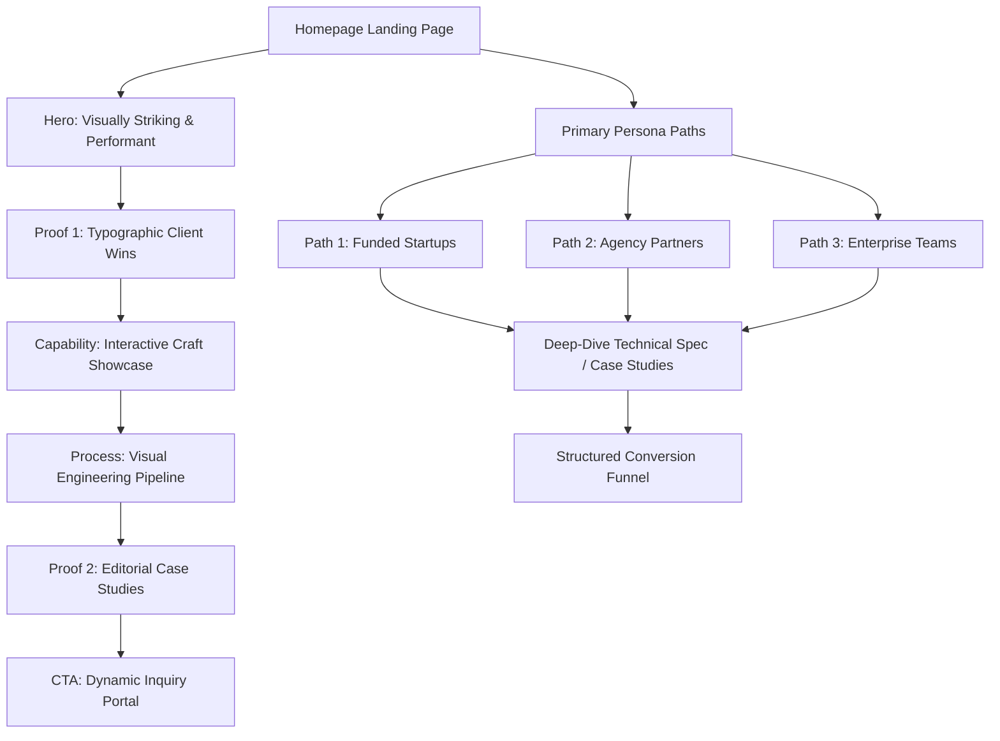

# Strategic UX & Information Architecture Report
## Premium Creative Technology and AI-Web Agency Website

This strategic report outlines the user experience (UX) architecture, persona journeys, sitemap, trust-building mechanisms, and conversion funnel for a premium creative technology and AI-web agency. The goal is to build instant credibility, showcase deep technical and design craft, and convert high-value leads.

---

## 1. Persona Journeys & Psychographic Anchors

To design an effective experience, we must understand the core psychological profiles, barriers, and conversion paths of our three primary high-value user personas.

### Persona 1: The Funded Startup Founder
* **Psychographic Profile:** Driven by speed, category disruption, and status. They want their product to look premium and feel highly advanced to attract users and future investment. They value autonomy and visible progress.
* **Core Desires:** Quick market validation, high craft that commands premium brand positioning, and an agency that acts as an extension of their team.
* **Core Anxieties & Fears:** Paying a premium for a generic agency that delivers late; wasting precious runway; launching a slow, buggy, or visually uninspired product that damages brand trust.
* **Primary Trust Barrier:** *Competence & Speed.* They worry the agency cannot execute at their pace or lack the high-end taste required to stand out.
* **The Conversion Path:**
  1. **Landing:** Visually striking, high-performance hero showing motion and interaction craft (proving aesthetic capability instantly).
  2. **Trust Signal:** Typography-led metric showing launch velocity and post-launch fundraising successes of previous startup clients.
  3. **Evaluation:** Quick-read case studies highlighting tangible product design iterations and functional interactive prototypes.
  4. **Action:** An interactive, low-friction project scope calculator or a direct "Book a Technical Jam Session" CTA.

### Persona 2: The Agency Director (Seeking a Production/Dev Partner)
* **Psychographic Profile:** Highly professional, detail-oriented, and busy. They need a reliable white-label or co-branded production partner to extend their technical capacity. They value process predictability and engineering rigor.
* **Core Desires:** Flawless technical execution, clean codebase, adherence to design specs, and frictionless developer-to-developer communication.
* **Core Anxieties & Fears:** Partner missing deadlines, causing agency reputational damage; messy code that their internal team cannot maintain; hidden fees or poor communication.
* **Primary Trust Barrier:** *Integrity & Compatibility.* They worry the partner will cut corners, fail to write clean code, or over-promise on engineering capabilities.
* **The Conversion Path:**
  1. **Landing:** Direct navigation to "For Agencies" / Technical Capabilities section showing precise code architecture and stack performance metrics.
  2. **Trust Signal:** Deep process transparency showing workflow integrations (e.g., Figma-to-code pipelines, testing suites, CI/CD routines).
  3. **Evaluation:** Behind-the-scenes case studies that focus on code quality, performance audits (Lighthouse scores, Core Web Vitals), and clean system engineering.
  4. **Action:** A direct developer-to-developer calendar booking or a secure file-upload lane for their Figma files to get an immediate technical feasibility audit.

### Persona 3: The Enterprise Product Manager (Seeking Custom Software & AI Dashboards)
* **Psychographic Profile:** Risk-averse, highly analytical, and focused on institutional validation. They need custom, complex internal tools or client-facing AI dashboards that integrate cleanly with existing legacy infrastructure.
* **Core Desires:** Deep custom system design, enterprise-grade security, scalability, and predictable compliance.
* **Core Anxieties & Fears:** Data leaks; failing security audits; expensive software that internal teams reject due to poor UX; custom solutions that break legacy systems.
* **Primary Trust Barrier:** *Legitimacy & Security.* They worry the agency is a "creative-only shop" without the engineering depth to handle enterprise security, compliance (SOC 2, GDPR), or complex data engineering.
* **The Conversion Path:**
  1. **Landing:** Structured, authoritative positioning emphasizing custom software engineering, AI dashboard design, and compliance-first practices.
  2. **Trust Signal:** Clear certification badges (SOC 2 Type II, GDPR compliant, AWS Certified) alongside deep-dive system architecture diagrams.
  3. **Evaluation:** Institutional case studies detailing security protocols, database optimizations, high data-throughput reliability, and user adoption metrics.
  4. **Action:** A multi-step structured inquiry form that collects compliance requirements and routes them directly to a Technical Architect for a detailed proposal.

---

## 2. Sitemap & Section Structure (Narrative Architecture)

The homepage and site structure must build narrative momentum, systematically addressing doubts and building trust.



### Homepage: Section-by-Section Narrative Order & Psychological Logic

#### Section 1: The High-Performance Hero
* **Content:** Minimalist layout, large custom typography, performant motion graphic (e.g., interactive WebGL canvas or buttery-smooth SVG animation). Direct, plainer copy that communicates custom product design and software engineering.
* **Psychological Reasoning:** Instantly signals craft capability and aesthetic authority. High visual and technical execution removes the primary doubt of startup founders and agencies—that the agency is generic or technically limited. It keeps users on the page by satisfying their need for aesthetic excellence.

#### Section 2: Peer Validation (Editorial Client Wins)
* **Content:** A large-text typographical section highlighting 3-4 major wins (e.g., "$42M in funding secured by startup partners", "99.9% uptime achieved for enterprise dashboards"). No generic logo grids; instead, high-end editorial callouts naming the specific clients.
* **Psychological Reasoning:** Draws on outcome-led and authority social proof. By showing concrete business results rather than just logos, we address the enterprise PM's need for stability and the founder's need for velocity.

#### Section 3: The Interaction & Technology Canvas (Interactive Craft)
* **Content:** An interactive dashboard widget or design-to-code playground that users can manipulate directly on the homepage (e.g., changing styling variables, adjusting live interactive curves, or testing an AI text-to-UI micro-demonstration).
* **Psychological Reasoning:** Demonstrates competence through direct action (the "show, don't tell" rule). This shows agency directors and developers that we build highly custom, performant code that goes far beyond standard templates.

#### Section 4: System Architecture & Workflow Pipeline (Process Transparency)
* **Content:** An editorial, high-end visualization of the agency's workflow. It maps the project journey from structural wireframes and high-fidelity design tokens in Figma, to the automated testing suites, clean code integration, and secure cloud infrastructure.
* **Psychological Reasoning:** Addresses the integrity and legitimacy barriers of both Agency Directors and Enterprise PMs. By exposing the technical process and compliance checkpoints, we signal predictability and eliminate the fear of "black box" development.

#### Section 5: Editorial Case Studies (Curated Masterpieces)
* **Content:** 2-3 deep, highly curated case studies presented as editorial articles. Each study focuses on the specific challenge, the architectural decision-making, performance optimization metrics, and the eventual business outcome.
* **Psychological Reasoning:** Provides deep validation for highly skeptical buyers. Each case study represents one of the three primary personas, allowing each user to see their own situation mirrored perfectly.

#### Section 6: The Dynamic Inquiry Portal (The Close)
* **Content:** An elegant, highly interactive contact section that changes based on what the user selects (Startups vs. Enterprise vs. Agencies).
* **Psychological Reasoning:** Capitalizes on the narrative momentum built through the homepage. By personalizing the input lane, we reduce user friction and collect highly qualified leads.

---

## 3. Trust-Building & Editorial Proof Moments

Cheap-looking logo bands and generic feature grids with standard icons feel transactional and damage a premium brand's authority. High-value clients seek bespoke attention and deep technical competence.

### Premium Editorial Alternatives

| Current Generic Pattern | Premium Editorial Alternative | Psychological Benefit |
| :--- | :--- | :--- |
| **Logo Grid Band** (Gray-scale row of 10 client logos) | **Narrative Client Spotlights:** Large-scale, editorial pull-quotes with inline typography highlighting client name, specific metric, and project link. | Elevates the client relationship from a vendor transaction to a strategic partnership. |
| **Feature Grid** (3x3 grid with generic colored icons) | **System Architecture Blueprints:** Interactive SVG technical diagrams showing how we organize design tokens, API structures, or AI prompt routing pipelines. | Signals deep engineering competence, reducing risk for technical buyers. |
| **Star Rating Block** ("Rated 5 Stars on Clutch") | **Architectural Audio/Video Logs:** 30-second embedded case video snippets where previous startup founders or technical directors talk about the project's codebase quality. | Builds genuine human trust, avoiding the skepticism of generic reviews. |

---

## 4. Conversion & CTAs: Interactive Inquiry Design

High-value clients require distinct conversion lanes that match their purchase motivation and readiness.

### The Conversion Matrix

```
[ Primary Call to Action ] ──► "Initiate Project Spec" (Dynamic Multi-Step Portal)
                                     │
         ┌───────────────────────────┼───────────────────────────┐
         ▼                           ▼                           ▼
  [ Startup Lane ]            [ Agency Lane ]            [ Enterprise Lane ]
  Focus: Velocity & Taste     Focus: Compatibility       Focus: Security & Compliance
  • Scope estimator           • Drag & Drop spec sheet   • Detailed intake fields
  • Quick design audit        • Technical dev-to-dev      • Direct NDA request lane
  • Fast booking lane          scheduling                • Compliance spec match
```

### 1. The Dynamic Intake Form (Micro-Commitments)
* **Design:** An elegant multi-step progressive form that starts with a single, simple question: *"What are we building today?"* with clean, typographic buttons (e.g., "A category-defining product", "An enterprise software platform", "A long-term technical production partnership").
* **Psychology:** By utilizing progressive disclosure, we reduce cognitive load and avoid choice overload. Once a user clicks the first button, commitment and consistency psychology kicks in, making them highly likely to finish the remaining 3-4 quick fields (such as timeline, tech stack, and contact).

### 2. The Direct Developer Lane (For Agency Partners)
* **Design:** A dedicated conversion pathway for Agency Directors that sidesteps standard sales conversations. It features a simple file drop area: *"Have a Figma spec or project brief? Drop it here for a technical feasibility analysis in 24 hours."*
* **Psychology:** Respects the user's expertise and removes administrative friction. It shows that we value their time and speak their developer language.

### 3. The Enterprise RFP & NDA Gateway
* **Design:** A clean gateway for enterprise clients to initiate secure communications. It allows them to request a standard mutual NDA directly before sharing sensitive project specifications.
* **Psychology:** Reduces enterprise risk. By offering an NDA upfront, we remove a significant organizational trust barrier and show that we understand enterprise security and legal compliance.

---

## 5. Friction vs. Flow Calibration

A premium website must balance speed and immersion. If the site is too fast, the user misses the artistic craft and engineering detail, making the brand feel commoditized. If the site is too slow, the user gets frustrated and abandons it.

### Strategic Calibration

```
HIGH IMMERSION (Intentional Friction)                    FAST FLUIDITY (Frictionless Action)
   [Hero Graphic] ──► [Interactive Playground] ──► [Process Pipeline] ──► [Dynamic Inquiry Form]
   - Slow down for:       - Slow down for:           - Slow down for:        - Speed up for:
     Aesthetic value        Interaction craft          Engineering depth       Frictionless contact
```

#### Where to Slow the User Down (High Immersion)
1. **The Hero Experience:** Add a subtle interactive delay on the mouse cursor or coordinate canvas in the hero to encourage play and build a sense of wonder.
2. **The Interactive Craft Canvas:** Create an immersive playground where developers and founders can tweak styling or animations. This showcases deep interaction capabilities, which justify premium pricing.
3. **The Workflow Visualization:** Use structured scroll-driven animations to walk the user through the Figma-to-production pipeline step-by-step, proving our commitment to clean code.

#### Where to Speed the User Down (Fast Fluidity)
1. **Navigation:** Keep main page routes clear and immediate. Do not use complex custom scroll scripts or laggy page-transition blockers.
2. **Contact Paths:** Provide a fast-track text link: *"Prefer email? Write directly to our architects at build@agency.com."* for high-intent buyers who want to bypass form fields entirely.
3. **Responsive Performance:** Ensure perfect optimization on mobile and tablet screens, loading all interactive assets asynchronously to preserve high Core Web Vitals performance.

---

## 6. Realignment Recommendations (Summary Audit)

To align with this strategy, implement these immediate realignments on the current web properties:

1. **Remove standard logo ribbons:** Replace them with editorial typographic data callouts that link directly to case studies.
2. **Expose technical pipelines:** Replace generic "Our Services" grid cards with a visual system diagram mapping our design-token-to-code pipelines.
3. **De-clutter contact entry points:** Replace long single-page contact forms with the dynamic, progressive intake portal categorized by startup, agency, or enterprise profiles.
