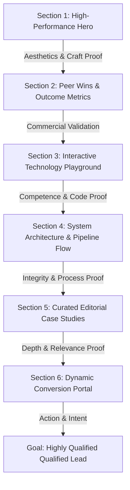

# Ultimate Creative Technology Studio Website Strategy & Specification
## Codename: "Refraction" — A Strategy Against Digital Template Slop

This document establishes the ultimate, research-backed strategy, sitemap, copywriting, and interactive blueprint to engineer an Awwwards-level creative technology and AI-web agency website. Built strictly on principles of high digital craft, typographic discipline, and hardware-level performance, this specification completely avoids generic SaaS structures and AI-generated clichés.

---

## 1. Brand Positioning & Postures

Instead of selling vague "digital transformation," the studio positions itself as an elite, high-craft engineering partner. We do not build websites from templates; we design and engineer bespoke software systems that balance high aesthetic polish with computational precision.

### The Three Foundational Postures
*   **Understated Confidence:** We reject loud, defensive marketing claims ("world-class," "the best"). We present our accomplishments, code structures, and performance benchmarks with quiet, factual authority.
*   **Technical Fluency:** We treat our clients as peers. We speak openly in context about engineering realities—such as GLSL shaders, database schemas, latency profiles, type-safety, and off-main-thread canvas rendering.
*   **Aesthetic Rigor:** We design layouts utilizing the vocabulary of spatial grids, editorial asymmetry, and precise typographic kerning, treating every viewport as a custom graphic canvas.

---

## 2. Target Users & Psychographic Conversion Paths

High-value clients have distinct anxieties and require custom conversion lanes that match their motivations.

```
                    PERSONA PATHWAYS & MOTIVATIONS
  ┌─────────────────────────┬─────────────────────────┬─────────────────────────┐
  │   Funded Tech Founder   │     Agency Director     │  Enterprise Product PM  │
  ├─────────────────────────┼─────────────────────────┼─────────────────────────┤
  │ Speed, Status, Disrupt  │ clean code, specs, CLS  │ SOC 2, Security, Uptime  │
  │ "Will it stand out?"    │ "Can they execute?"     │ "Is this stable?"       │
  ├─────────────────────────┼─────────────────────────┼─────────────────────────┤
  │   • Visual Hero         │   • Technical Pipeline  │   • System Diagrams     │
  │   • Velocity Proof      │   • Figma File Drop     │   • Secure RFP/NDA      │
  │   • Custom Scope Estim  │   • Dev-to-Dev Booking  │   • Compliance Badges   │
  └─────────────────────────┴─────────────────────────┴─────────────────────────┘
```

### Persona 1: The Funded Startup Founder
*   **Motivation:** Speed to market, visual status, and securing future investment. They want their product to stand out immediately.
*   **Anxiety:** Paying a premium for a slow, buggy template that makes them look generic.
*   **Conversion Path:** Immersive hero experience $\rightarrow$ Launch velocity proof metrics $\rightarrow$ High-fidelity product case studies $\rightarrow$ Dynamic scope estimator.

### Persona 2: The Creative Agency Director
*   **Motivation:** Expanding technical production capabilities with a reliable engineering partner.
*   **Anxiety:** Messy code that their internal developers reject, missed milestones, and CLS performance shifts.
*   **Conversion Path:** Technical capabilities overview $\rightarrow$ Figma-to-code pipeline details $\rightarrow$ Behind-the-scenes engineering case studies $\rightarrow$ Direct Figma-file upload lane for feasibility diagnostics.

### Persona 3: The Enterprise Product Manager
*   **Motivation:** Building secure, custom software dashboards and internal AI tools that interface cleanly with legacy infrastructure.
*   **Anxiety:** Security compliance breaches, expensive products rejected by users, and system lag under heavy real-time data loads.
*   **Conversion Path:** Factual custom software positioning $\rightarrow$ System architecture blueprints $\rightarrow$ Compliance badges (SOC 2, GDPR, AWS) $\rightarrow$ Secure NDA/RFP gateway.

---

## 3. Website Narrative & Sitemap

The website's homepage layout is structured to dismantle user skepticism sequentially. Every section serves a psychological purpose to build narrative momentum.



### The Sections Hierarchy
1.  **Section 1: The High-Performance Hero:** Creates an immediate sense of wonder and visual authority via elegant typography and an ambient WebGL canvas.
2.  **Section 2: Peer Validation (Factual Wins):** Outcome-based typographic statistics. Completely replaces cheap-looking grayscale client logo bands.
3.  **Section 3: The Interactive Tech Playground:** An active, high-performance canvas tool demonstrating our engineering depth in real-time.
4.  **Section 4: The Visual Workflow Pipeline:** High-end schematic diagram showing how we bridge the gap between design tokens and production code.
5.  **Section 5: Editorial Case Studies:** Three highly focused narratives, each explicitly designed to target one of our three core personas.
6.  **Section 6: The Dynamic Inquiry Portal:** Customized intake fields that adapt immediately to the user's category (Startup, Agency, or Enterprise).

---

## 4. Visual Design System

The visual language is cinematic, technical, and editorial, built to represent the intersection of creative art direction and robust logic.

### 4.1 Color Palette: "Chroma Obscura"
We utilize high-density cinematic shadows to make media assets, shaders, and text layers pop with ambient glow:

*   `void` (Canvas Background): `#050505` (HSL: 0, 0%, 2%)
*   `obsidian` (Primary Surface): `#0d0d0d` (HSL: 0, 0%, 5.1%)
*   `basalt` (Secondary Surface): `#121212` (HSL: 0, 0%, 7.1%)
*   `stardust` (Text Primary): `#ffffff` (HSL: 0, 0%, 100%)
*   `silver-dust` (Text Secondary): `#f0f0f0` (HSL: 0, 0%, 94.1%)
*   `lead` (Text Muted): `#8a8a8a` (HSL: 0, 0%, 54.1%)
*   `aureolin-amber` (Primary Accent): `#c9a84c` (HSL: 45, 54%, 55%)
*   `amber-glow` (Emissive Accent): `#f3cf65` (HSL: 45, 84%, 68%)
*   `ethereal-teal` (Secondary Metric Accent): `#14c7c0` (HSL: 178, 82%, 43%)
*   `coal` (Thin Boundaries): `#1a1a1a` (HSL: 0, 0%, 10.2%)

### 4.2 Typography Pairings: "The Alchemist"
*   **Primary Sans-Serif:** `Geist Sans` or `Inter` (legible, structural grid base).
*   **Secondary Serif:** `Cormorant Garamond` (high-contrast, razor-sharp editorial accents).
*   **Data & Metrics:** `Geist Mono` or `JetBrains Mono` (technical instrumentation).

#### Desktop Typography Matrix (Viewport $\ge$ 1280px)
*   **H1 Display Title:** `7.5rem (120px) // line-height: 1.0 // letter-spacing: -0.04em` (Sans-Serif)
*   **H2 Section Title:** `3.5rem (56px) // line-height: 1.1 // letter-spacing: -0.03em` (Sans-Serif/Serif)
*   **Body Large:** `1.25rem (20px) // line-height: 1.5 // letter-spacing: 0em` (Sans-Serif)
*   **Body Copy:** `1.0rem (16px) // line-height: 1.6 // letter-spacing: 0.01em` (Sans-Serif)
*   **Monospace Tag:** `0.8125rem (13px) // line-height: 1.5 // letter-spacing: 0.2em uppercase` (Mono)

### 4.3 Signature Motif: "The Refraction Coordinate Lattice"
Subtle grid lines cross the viewport, meeting at asymmetric, mathematical intervals. Where these lines intersect, we display active coordinate labels (e.g. `[45.28N // 9.18E]`) that update slightly based on scroll percentage. Overlaying structural containers are heavy, glassmorphic "prisms" (`backdrop-filter: blur(12px) contrast(1.1) brightness(0.9)`) that split and bend the colors, lines, and text passing underneath them.

---

## 5. Motion & Interaction Choreography

Our animations represent physical weight, inertia, and fluid control, systematically avoiding disorienting camera movements or lag-heavy libraries.

```
                    MOTION & INTERACTION SYSTEM STACK
  ┌────────────────────────────────────────────────────────────────────────┐
  │ Lenis Smooth Scroll  ──► Normalizes mechanical wheel input across OS   │
  ├────────────────────────────────────────────────────────────────────────┤
  │ GSAP & ScrollTrigger ──► Drives pins, horizontal slide translation, GLSL│
  ├────────────────────────────────────────────────────────────────────────┤
  │ Framer Motion        ──► Handles SPA route-level enter/exiting pages   │
  ├────────────────────────────────────────────────────────────────────────┤
  │ WebGL / Three.js     ──► Renders volumetric noise & displacement warp   │
  └────────────────────────────────────────────────────────────────────────┘
```

### 5.1 Easing & Timing Specifications
*   **Dramatic Reveals:** `cubic-bezier(0.76, 0, 0.24, 1)` (Expo-InOut) for preloader transitions.
*   **Typographic Stagger Reveals:** `cubic-bezier(0.16, 1, 0.3, 1)` (Expo-Out) for snappy, lightweight entry.
*   **Micro-Hover Tweaks:** `cubic-bezier(0.25, 1, 0.5, 1)` (Quad-Out) for navigation anchors.

### 5.2 Physics-Based Micro-Interactions
*   **Inertial LERP Cursor:** The default browser cursor is hidden. We render a custom dot and ring driven by a linear interpolation loop updating at 60Hz:
    $$x_{\text{current}} = x_{\text{current}} + (x_{\text{target}} - x_{\text{current}}) \times 0.12$$
    When hovering interactive components, the ring expands, blend mode shifts (`mix-blend-mode: difference`), and the inner dot collapses.
*   **Magnetic Pull Fields:** Interactive CTAs draw the entire element boundary toward the active cursor when within an `80px` radius, using dynamic calculations:
    $$\text{pull}_{X} = \frac{e.clientX - \text{btn}_{X}}{\text{bounds.width}} \times 18\text{px}$$
    On cursor exit, the element snaps back to the home state with a custom spring curve: `stiffness: 150, damping: 15, mass: 0.1`.
*   **Split-Text Line Reveals:** Section headings are split into individual words wrapped in overflow-hidden containers, sliding up vertically by staggered timelines.
*   **Shader Displacement Hover:** Portfolio images do not scale with CSS. Hovering triggers a custom WebGL fragment shader displacement map that generates organic liquid ripples on the texture UV coordinates:
    ```glsl
    vec2 distortedUv = vec2(vUv.x + displacement.r * uDispPower * 0.1, vUv.y + displacement.g * uDispPower * 0.1);
    gl_FragColor = texture2D(uTexture, distortedUv);
    ```

---

## 6. Technical Architecture & Performance Budget

Visual complexity must never compromise speed. The website remains blazingly responsive by adhering to a strict, non-negotiable performance budget.

### 6.1 Core Web Vitals Targets (Simulated under 3G/Slow 4G + 4x CPU Throttling)
*   **LCP (Largest Contentful Paint):** `< 1.0s (Desktop) / < 1.5s (Mobile)`
*   **INP (Interaction to Next Paint):** `< 50ms (Desktop) / < 100ms (Mobile)`
*   **CLS (Cumulative Layout Shift):** `0.00`
*   **First Load JS Bundle Weight:** `< 150kB gzipped` (Next.js core + Tailwind runtime).
*   **Interactive Chunks Limit:** `< 50kB` per deferred module.

### 6.2 WebGL Optimization & Lifecycle Rules
1.  **Dynamic Rendering (R3F):** Enforce `frameloop="demand"` inside React Three Fiber. The scene only recalculates frames on active user inputs or camera movement.
2.  **Scene Memory Recovery:** Every unmounted 3D component must manually traverse the scene graph, calling `.dispose()` on all geometries, materials, and textures to prevent browser tab crashes during long sessions.
3.  **Next.js Dynamic Imports:** Wrap heavy 3D canvases in `next/dynamic` with `ssr: false`, deferring initialization via `IntersectionObserver` until the component is within `200px` of the viewport.

---

## 7. Anti-AI-Slop & Craft Coprywriting Rules

To maintain high editorial authority and keep our copy human, direct, and sophisticated, we enforce strict copywriting guidelines.

### 7.1 Banned AI clichés & Word Replacements

| Banned Term (AI-isms & Slop) | The Rationale | Premium Human Replacement |
| :--- | :--- | :--- |
| **"unlock your potential"** | Empty self-help cliché; lacks concrete business value. | *Scale system capacity, improve team output, capture lost revenue* |
| **"transform your business"** | Vague, over-promised marketing hyperbole. | *Modernize your codebase, automate manual ops, replace legacy tools* |
| **"cutting-edge / state-of-the-art"**| Pretentious shortcut words. Focus on concrete features instead. | *Low-latency, custom-built, built on modern Next.js primitives* |
| **"innovative digital experiences"** | Extremely saturated; conveys absolutely zero meaning. | *Interactive interfaces, bespoke applications, high-fidelity software* |
| **"in today's rapidly changing..."**  | Standard AI essay opener. Signals automated slop instantly. | *Start immediately with the problem: "Modern data pipelines are brittle."* |
| **"revolutionize / empower"** | Messianic vocabulary that sounds fake to engineering directors. | *Accelerate, simplify, automate, give engineers direct control* |
| **"seamlessly integrated"** | Overused; integration is always messy. Focus on the method. | *Direct API connection, unified data layer, interfaced via gRPC* |
| **"testament to our passion"** | Dramatic, emotional, and unprofessional in technical contexts. | *Proven by, demonstrated by our production record, the result of* |
| **"leverage / utilize"** | Pretentious synonyms for "use." | *Use, build on, rely on, deploy* |
| **"nestled in / tapestry / delve"** | Literary tells of LLM generation. | *Avoid completely. Use direct spatial descriptions or omit.* |
| **"robust / seamless / ecosystem"** | Corporate buzzwords that dilute engineering precision. | *Stable, reliable, zero-downtime, infrastructure, software suite* |

### 7.2 Core Copywriting Rules
*   **Active Voice:** Never use passive voice where the actor is hidden (e.g., replace *"A scalable system was designed"* with *"We design scalable systems"*).
*   **Variable Sentence Length:** Avoid LLM-like monotone rhythms. Pair long, descriptive, technical descriptions with short, high-conviction assertions (e.g., *"No middleware bloat. Just direct, fast rendering."*).
*   **Sentence Case:** Headlines must strictly use sentence case (capitalizing only the first word). Title Case feels automated, corporate, and commercial; sentence case feels editorial, relaxed, and deliberate.

---

## 8. Section-by-Section Design, Copy, & Interaction Spec

Below is the exact production-ready content and interactive instructions to be laid out in Next.js + React.

---

### Section 1: The High-Performance Hero

*   **Layout:** Full-viewport, minimalist, asymmetrical container. Hairline thin borders frame the screen. An oversized heading layer is sandwiched between a background 3D canvas and foreground DOM UI items.
*   **Typography:** Primary Headline in massive Sans-Serif (`10vw`), line-height `0.95`, tight kerning. Subheadline in readable Sans-Serif (`1.25rem`), Mono tags (`11px` all-caps).

#### Exact Copy
> **Monospace Metadata Tag:**
> `[ NODE 00 // SIGNAL STUDIO // CREATIVE ENGINEERING ]`
> 
> **Primary Headline:**
> We build software for teams who care about the details.
> 
> **Subheadline:**
> An independent engineering studio constructing high-fidelity web frontends, interactive design systems, and robust database architectures. No compromise on performance, typography, or code quality.
> 
> **CTA Link:**
> `[ Start building // → ]`

#### Interactive & Motion Choreography
*   **Loading Timeline (GSAP):**
    1.  `0.0s`: Structural borders draw in via `scaleX`/`scaleY` transitions.
    2.  `0.3s`: Title characters mask up from `110%` to `0%` inside overflow-hidden parent layers (`stagger: 0.02s`, ease: `expo.out`).
    3.  `0.6s`: Background Three.js canvas fades in and camera slowly zooms backward along the Z-axis, simulating a physical camera lens adjustment.
*   **Atmospheric Shader:** The background canvas renders a transparent, ambient 2D Simplex Noise field in deep luxury colors (`#050505` to `#110e19`). Scroll speed shifts a chromatic aberration uniform:
    $$\text{chromaticOffset} = \text{uScrollSpeed} \times 0.015$$
    This separates RGB channels dynamically relative to viewport acceleration.
*   **Coordinate Monitor:** A floating micro-mono label displays the mouse coordinate space mapped inside GPU dimensions (`-1.0` to `1.0`), shifting dynamically as the cursor moves.

---

### Section 2: Factual Peer Validation (Typographic Wins)

*   **Layout:** An asymmetrical editorial spread featuring vast margins. It completely discards typical gray-scale grayscale logo tracks in favor of outcome-based typographic blocks.
*   **Typography:** Stats in oversized monospaced variables (`6rem`), explanatory notes in editorial Serif italics (`2.25rem`), and body metadata at `12px` mono.

#### Exact Copy
> **Monospace Section Badge:**
> `[ DATA 01 // CORE METRICS ]`
> 
> **Outcome 1:**
> -   `95%+` Lighthouse Score
> -   *Every frontend we deliver is audited for maximum loading speeds and search engine readability before release.*
> 
> **Outcome 2:**
> -   `-38%` Latency Reduction
> -   *Replaced legacy software stacks with high-density, real-time dashboards that keep dispatch pipelines responsive under heavy user loads.*
> 
> **Outcome 3:**
> -   `0.00` Layout Shift
> -   *We write vanilla code, target hardware-level rendering limits, and avoid heavy frameworks to keep codebases simple and clean.*

#### Interactive & Motion Choreography
*   **Interactive Scrolled Counter (GSAP):** Numbers animate dynamically from 0 to the target value when the section enters the viewport (`start: "top 80%"`).
*   **Text Split Reveal:** Explanatory sentences fade in line-by-line with a subtle vertical tilt.
*   **Spotlight Coordinate Hover:** Mousing over the statistics reveals a subtle, warm amber glow source (`rgba(201, 168, 76, 0.07)`) centered at the cursor coordinates, creating soft depth.

---

### Section 3: The Interaction Playground (Technology Canvas)

*   **Layout:** A two-column split layout.
    *   **Left Column:** Minimal, dense typographic specifications describing the engineering rules.
    *   **Right Column:** A live, high-performance interactive playground containing a modular SVG graphic grid or particle field that users can manipulate with sliders or coordinates.
*   **Typography:** Headers in classical Serif (`2.5rem`), data labels in monospaced `Geist Mono` (`13px`).

#### Exact Copy
> **Monospace Section Badge:**
> `[ PLAYGROUND 02 // INTERACTION SCIENCE ]`
> 
> **Heading:**
> Performance you can feel.
> 
> **Description:**
> Tap or drag the coordinates on the right. This interactive grid uses GPU-normalized vector paths and local spring interpolation loops, avoiding heavy JavaScript rendering. It runs at a sustained sixty frames per second.
> 
> **Live Playground Labels:**
> -   `[ PARAMETER_01: STIFFNESS ]`
> -   `[ PARAMETER_02: DAMPING_FACTOR ]`
> -   `[ CURRENT_FPS: 60.00 ]`

#### Interactive & Motion Choreography
*   **Spring Physics Canvas Loop:** The right column houses an SVG spline system driven by custom spring mathematics. Dragging coordinates pulls the spline mesh organically, with spring physics adapting immediately when values are shifted.
*   **Interactive Sliders:** Custom-designed inputs with fine, `1px` borders, utilizing amber glowing focus states and technical coordinates indicators.

---

### Section 4: System Architecture & Workflow Pipeline

*   **Layout:** A full-bleed technical schematic mapping our workflow. Thin grid lines outline step-by-step connections.
*   **Typography:** Stage titles in bold monospace uppercase (`13px`), description blocks in clean Sans-Serif (`16px`).

#### Exact Copy
> **Monospace Section Badge:**
> `[ PROCESS 03 // ARCHITECTURAL ROUTE ]`
> 
> **Stage I: Architectural Diagnostics & Scope**
> We start by auditing your existing codebases, performance bottlenecks, and systems architecture. We deliver a clear, highly technical blueprint outlining exactly how the software will be structured, avoiding surprises down the line.
> 
> **Stage II: High-Fidelity Schematics & Token Design**
> We translate conceptual directions into high-fidelity layout schematics and interactive design tokens. We build a comprehensive visual design system before writing production code.
> 
> **Stage III: Core Engineering & Database Assembly**
> We write type-safe APIs, structure clean database schemas, and assemble frontend components with absolute precision. We avoid heavy external dependencies, opting to write clean, vanilla code.
> 
> **Stage IV: Performance Calibration & Launch**
> Before shipping, we put the software through extensive stress testing. We profile database queries, optimize Webpack configurations, and tune visual interactions to guarantee a stable sixty frames per second.

#### Interactive & Motion Choreography
*   **Scroll-Driven Path Drawing (GSAP):** Thin connector lines draw in as the user scrolls, leading the eye vertically from Stage I down to Stage IV.
*   **Active Stage Spotlight:** As each stage enters focus, its borders expand slightly, the background glass panel illuminates, and a pulsing status LED shifts from gray to active teal.

---

### Section 5: Curated Editorial Case Studies

*   **Layout:** Large-scale, full-bleed asymmetrical cards. We avoid generic, uniform thumbnail rows in favor of staggered, overlapping panels.
*   **Typography:** Project titles in oversized editorial Serif (`4.5rem`), subheadings in Sans-Serif (`1.25rem`), and metadata parameters at `12px` mono.

#### Exact Copy
> **Case Study 1: Apex Dispatch**
> -   *Sector:* Global Supply Chain // *Impact:* -38% Scheduling Latency
> -   *Tagline:* Modernizing global dispatch workflows through high-density UI systems.
> -   *Summary:* Apex was managing fleet scheduling using a fragmented suite of slow legacy tools. We replaced their entire stack with a unified, high-density dispatch dashboard. Built on a custom canvas map layer with real-time WebSocket state management, the new system allows schedulers to coordinate hundreds of routes simultaneously. We prioritized rapid keyboard inputs and a dense, dark-mode visual interface designed to reduce eye strain.
> 
> **Case Study 2: Verdant Epoch**
> -   *Sector:* Venture Capital // *Impact:* +112% Form Completion Rate
> -   *Tagline:* An immersive cinematic landing page for a sustainable venture fund.
> -   *Summary:* Verdant Capital needed a digital presence that stood out in a sea of sterile financial sites. We engineered a highly immersive, interactive experience utilizing custom GLSL shaders, scroll-driven WebGL topography, and crisp typography. By keeping bundle sizes under 150kb and optimizing assets for mobile GPU limits, we delivered a cinematic interactive narrative that runs at a stable 60fps.
> 
> **Case Study 3: Quant Ledger**
> -   *Sector:* Quantitative Finance // *Impact:* Zero-Lag 500k Data Points
> -   *Tagline:* A high-throughput financial data visualizer for algorithmic traders.
> -   *Summary:* Quant Analytics needed to display high-frequency tick data to institutional traders in real-time. We engineered a custom dashboard featuring lightweight WebGL canvas charts and a highly optimized Web Worker architecture that handles incoming high-speed data streams off the main thread. Traders can seamlessly pan, zoom, and filter half a million transaction points without a single dropped frame.

#### Interactive & Motion Choreography
*   **Image Displacement Shaders:** Hovering on case study panels disables standard scaling. The system triggers a grayscale displacement texture ripple, warping the image pixels organically inside GPU space.
*   **Shared Element Transitions (Barba.js + GSAP):** Clicking a project card measures its screen boundaries (`getBoundingClientRect()`) and animates the image to scale full-viewport, creating a seamless entry to the detail view without loading blank states.
*   **Asymmetric Scroll Drift:** The left and right project columns scroll at slightly offset ratios (`data-scroll-speed="1.15"` vs `0.85`), producing spatial parallax.

---

### Section 6: The Dynamic Inquiry Portal (The Close)

*   **Layout:** Minimalist, high-density contact form with thin single-pixel dividers.
*   **Typography:** Input labels in monospaced Geist Mono uppercase (`12px`), input values in clean Sans-Serif (`24px`).

#### Exact Copy
> **Monospace Section Badge:**
> `[ TERMINAL 05 // INITIATE DIAGNOSTICS ]`
> 
> **Header:**
> Let's discuss your system requirements.
> 
> **Category Selection:**
> -   `[01 / A Category-Defining Product (Startup)]`
> -   `[02 / A Long-Term Production Partner (Agency)]`
> -   `[03 / Custom Software or AI Integration (Enterprise)]`
> 
> **Dynamic Inputs (Adapts on Selection):**
> -   `[01 / NAME / COMPANY]`
> -   `[02 / STACK / DATA INFRASTRUCTURE]`
> -   `[03 / ESTIMATED RUNWAY / TIMELINE]`
> 
> **Action Button:**
> `[ Deploy Inquiry // → ]`

#### Interactive & Motion Choreography
*   **Progressive Disclosure Fields:** Clicking a category selection collapses irrelevant questions and reveals tailored input fields using clean height transitions (`Framer Motion`).
*   **Input Underline Illumination:** Active fields illuminate their bottom borders from dark gray to Aureolin Amber (`#c9a84c`). A micro-monospace validation tick coordinates and displays on the top-right when the inputs are active.
*   **Direct Figma-File Drop (Agency Lane):** Displays a glowing border drop zone with micro-ticks where users can drag design sheets directly for immediate feasibility reviews.

---

## 9. Implementation Plan for Kimi/Windsurf Developers

To implement this premium strategy safely and efficiently in our Next.js App Router codebase, developers will work in four progressive phases:

```
  Phase 1: Foundation ──► Phase 2: Shell & Copy ──► Phase 3: Animation ──► Phase 4: WebGL & Perf
  - CSS tokens config      - Static layouts         - Lenis, magnetic btns   - Dynamic canvas
  - Font pairings          - Precision copy         - Stagger reveals        - Cleanup & Disposes
```

### Phase 1: Foundation & Design Token Setup
1.  **Configure Typography:** Map `Geist Sans` and `Geist Mono` inside `src/app/layout.tsx` using `next/font`. Inject `Cormorant Garamond` from Google Fonts.
2.  **Establish Tailwind Theme:** Edit `src/app/globals.css` to inject our "Chroma Obscura" HSL palettes, font pairings, and spacing limits into the Tailwind CSS v4 `@theme inline` block.
3.  **Implement Noise Overlay:** Build the static visual grain overlay inside `src/app/layout.tsx` to establish analog screen texture immediately.

### Phase 2: Section Shells & Human Copy Assembly
1.  **Build Main Layout:** Create `src/app/page.tsx` laying out the 6 narrative sections in structural, semantic HTML landmarks (`<header role="banner">`, `<main id="main-content">`, `<section>`, etc.).
2.  **Inject Copy Toolkit:** Populate all copy fields with the approved Understated/Technical copywriting. Strictly audit the pages using local linting tools to guarantee zero forbidden terms survive.
3.  **Implement Responsive Grids:** Apply the asymmetric grid structures with custom padding clamps, ensuring visual alignment behaves on mobile viewports.

### Phase 3: Core Animation & Tactical Interactions
1.  **Integrate Lenis Scroll:** Deploy a global smooth scroll wrapper in `src/components/ScrollProvider.tsx`. Auto-disable smooth scroll if users prefer reduced motion.
2.  **Configure GSAP Choreography:** Map out scroll pinning sequences and horizontal showcase gallery layouts inside `src/components/Showcase.tsx` using GSAP context cleanups.
3.  **Build Custom Cursor & Magnetic Fields:** Write `src/components/CustomCursor.tsx` and `src/components/MagneticButton.tsx` leveraging LERP physics vectors and spring damping constants.
4.  **Implement Split-Text reveals:** Construct a reusable split-text reveal helper to animate section headlines.

### Phase 4: Dynamic WebGL Canvas & Performance Optimization
1.  **Assemble WebGL Scene:** Create `src/components/WebGLScene.tsx` containing Three.js particle networks and Simplex Noise fragment shaders.
2.  **Deploy Lazy Loading Wrapper:** Implement the `IntersectionObserver` wrapper around the canvas component inside `src/components/Hero.tsx` to lazy load WebGL resources.
3.  **Implement Resource Disposal loops:** Write manual `.dispose()` cleanup loops to capture and dispose of textures, materials, and geometries on unmount.
4.  **Audit Accessibility & Mobile Limits:** Execute keyboard focus trapping within overlays, check WCAG contrast parameters, and completely bypass cursors, canvas arrays, and heavy translations on devices below `768px` wide.

---

## 10. The Ultimate Luxury & Craft Verification Checklist

Before deploying the final portfolio code, developers and designers must verify that every single interactive element satisfies the strict guidelines below.

```
       [ STUDIO CRAFT VERIFICATION METRICS ]
 ┌────────────────────────────────────────────────────────┐
 │  Aesthetics & Layout Audits:                           │
 │  [ ] Zero Bento Grids are present in visual layouts.  │
 │  [ ] Dynamic asymmetry governs all portfolio listings. │
 │  [ ] Every viewport has at least 15% breathing space.   │
 │                                                        │
 │  Coprywriting & Tone Audits:                           │
 │  [ ] Zero occurrences of banned AI-isms (e.g. utilize). │
 │  [ ] Sentence case is used on all headers.            │
 │  [ ] Monotone rhythmic sentence patterns are removed.   │
 │                                                        │
 │  Motion & Interaction Audits:                          │
 │  [ ] Custom cursors possess LERP weight & lag.         │
 │  [ ] Buttons attract cursors inside 80px magnetic pull.│
 │  [ ] All dynamic overlays are bound to ESC exits.      │
 │  [ ] Target tap boundaries are at least 44x44px.       │
 │  [ ] Shaders operate on-demand to save CPU resources.  │
 │                                                        │
 │  Performance & Accessibility Audits:                   │
 │  [ ] LCP on emulated Mobile 3G is under 1.5s.          │
 │  [ ] All WebGL canvases dynamic() lazy loaded.         │
 │  [ ] Manual dispose() garbage collectors are set.      │
 │  [ ] prefers-reduced-motion replaces scroll pinning.   │
 └────────────────────────────────────────────────────────┘
```

By adhering to this comprehensive strategic blueprint, the studio website will emerge as a category-defining creative technology masterpiece—uncompromising in design, engineering speed, and inclusive accessibility.
